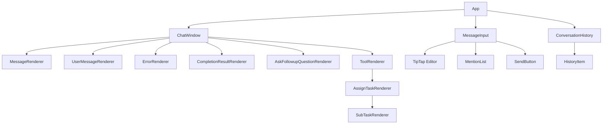
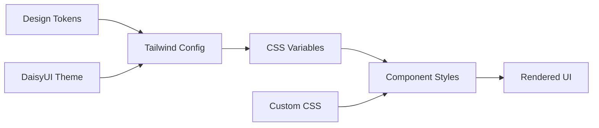
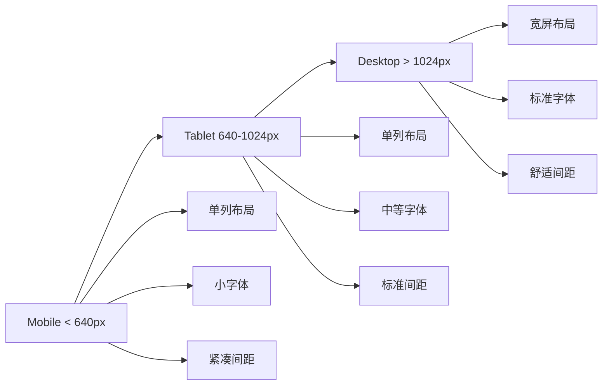

# Design Document

## Overview

本设计文档定义了 Amigo WebSocket 应用前端界面重构的完整设计方案。我们将建立一个统一的设计系统（Design System），包含颜色规范、字体层级、间距系统、组件样式等，并重构现有组件以符合新的设计规范。

设计目标：
- 建立清晰的视觉层次
- 统一颜色使用和语义
- 简化组件样式
- 提升可读性和易用性
- 确保响应式适配

## Architecture

### Design System 架构

```
Design System
├── Tokens (设计令牌)
│   ├── Colors (颜色)
│   ├── Typography (字体)
│   ├── Spacing (间距)
│   ├── Radius (圆角)
│   └── Shadows (阴影)
├── Components (组件)
│   ├── Message Bubbles (消息气泡)
│   ├── Task Cards (任务卡片)
│   ├── Buttons (按钮)
│   ├── Input (输入框)
│   └── Badges (徽章)
└── Layouts (布局)
    ├── Chat Window (聊天窗口)
    ├── Conversation History (会话历史)
    └── Message Input Area (输入区域)
```

### 技术栈

- **样式方案**: Tailwind CSS 4 + DaisyUI (保持现有技术栈)
- **主题定制**: 通过 DaisyUI 主题配置实现设计令牌
- **组件样式**: 使用 Tailwind 工具类 + 自定义 CSS 变量
- **响应式**: Tailwind 响应式断点系统

## Components and Interfaces

### 1. Design Tokens (设计令牌)

#### 1.1 Color Palette (色板)

```css
/* 主色调 - 用于主要操作和强调 */
--color-primary: #3b82f6;        /* 蓝色 */
--color-primary-hover: #2563eb;
--color-primary-light: #dbeafe;

/* 成功色 - 仅用于成功状态 */
--color-success: #10b981;        /* 绿色 */
--color-success-light: #d1fae5;

/* 错误色 - 仅用于错误和警告 */
--color-error: #ef4444;          /* 红色 */
--color-error-light: #fee2e2;

/* 警告色 - 用于等待和警告状态 */
--color-warning: #f59e0b;        /* 橙色 */
--color-warning-light: #fef3c7;

/* 信息色 - 用于提示信息 */
--color-info: #3b82f6;           /* 蓝色 */
--color-info-light: #dbeafe;

/* 中性色 - 用于文本和背景 */
--color-neutral-50: #fafafa;
--color-neutral-100: #f5f5f5;
--color-neutral-200: #e5e5e5;
--color-neutral-300: #d4d4d4;
--color-neutral-600: #525252;
--color-neutral-700: #404040;
--color-neutral-900: #171717;
```

#### 1.2 Typography (字体层级)

```css
/* 标题 */
--font-size-h1: 1.875rem;  /* 30px */
--font-size-h2: 1.5rem;    /* 24px */
--font-size-h3: 1.25rem;   /* 20px */

/* 正文 */
--font-size-base: 0.875rem;    /* 14px */
--font-size-lg: 1rem;          /* 16px */

/* 辅助文本 */
--font-size-sm: 0.75rem;   /* 12px */
--font-size-xs: 0.625rem;  /* 10px */

/* 字重 */
--font-weight-normal: 400;
--font-weight-medium: 500;
--font-weight-semibold: 600;
--font-weight-bold: 700;
```

#### 1.3 Spacing (间距系统)

```css
/* 基于 4px 的间距系统 */
--spacing-1: 0.25rem;   /* 4px */
--spacing-2: 0.5rem;    /* 8px */
--spacing-3: 0.75rem;   /* 12px */
--spacing-4: 1rem;      /* 16px */
--spacing-5: 1.25rem;   /* 20px */
--spacing-6: 1.5rem;    /* 24px */
--spacing-8: 2rem;      /* 32px */
--spacing-10: 2.5rem;   /* 40px */
```

#### 1.4 Border Radius (圆角)

```css
--radius-sm: 0.375rem;   /* 6px */
--radius-md: 0.5rem;     /* 8px */
--radius-lg: 0.75rem;    /* 12px */
--radius-xl: 1rem;       /* 16px */
```

#### 1.5 Shadows (阴影)

```css
/* 最小化阴影使用 */
--shadow-sm: 0 1px 2px 0 rgb(0 0 0 / 0.05);
--shadow-md: 0 4px 6px -1px rgb(0 0 0 / 0.1);
--shadow-none: none;
```

### 2. Message Components (消息组件)

#### 2.1 User Message (用户消息)

**设计规范**:
- 位置: 右对齐
- 背景色: `--color-primary`
- 文字颜色: 白色
- 圆角: `--radius-lg` (12px)
- 内边距: `--spacing-3 --spacing-4` (12px 16px)
- 最大宽度: 70%
- 字体大小: `--font-size-base` (14px)

**状态**:
- Pending: 显示旋转图标，透明度 0.7
- Sent: 正常显示

**Tailwind 类名**:
```
chat chat-end
chat-bubble bg-primary text-white
rounded-xl px-4 py-3
max-w-[70%]
```

#### 2.2 System Message (系统消息)

**设计规范**:
- 位置: 左对齐
- 背景色: `--color-neutral-100`
- 文字颜色: `--color-neutral-900`
- 圆角: `--radius-lg` (12px)
- 内边距: `--spacing-3 --spacing-4` (12px 16px)
- 最大宽度: 80%
- 字体大小: `--font-size-base` (14px)

**Tailwind 类名**:
```
chat chat-start
chat-bubble bg-neutral-100 text-neutral-900
rounded-xl px-4 py-3
max-w-[80%]
```

#### 2.3 Error Message (错误消息)

**设计规范**:
- 布局: 居中全宽卡片
- 背景色: `--color-error-light`
- 边框: 1px solid `--color-error` (透明度 0.3)
- 圆角: `--radius-lg` (12px)
- 内边距: `--spacing-4` (16px)
- 图标大小: 20px
- 标题字体: `--font-weight-semibold`

**Tailwind 类名**:
```
w-full max-w-4xl
bg-error/10 border border-error/30
rounded-xl p-4
flex items-start gap-3
```

#### 2.4 Completion Result (完成消息)

**设计规范**:
- 位置: 左对齐
- 背景色: `--color-success-light`
- 文字颜色: `--color-success` (深色)
- 圆角: `--radius-lg` (12px)
- 内边距: `--spacing-4` (16px)
- 图标: CheckCircle, 16px

**Tailwind 类名**:
```
chat chat-start
chat-bubble bg-success/10 text-success-content
rounded-xl px-4 py-4
border border-success/20
```

### 3. Task Card Components (任务卡片组件)

#### 3.1 Task Card (任务卡片)

**设计规范**:
- 背景色: 白色 (`--color-neutral-50`)
- 边框: 1px solid `--color-neutral-200`
- 圆角: `--radius-lg` (12px)
- 内边距: `--spacing-4` (16px)
- 阴影: `--shadow-sm`
- 间距: 任务之间 `--spacing-4` (16px)

**结构**:
```
┌─────────────────────────────────┐
│ [图标] 任务 #1      [状态徽章]  │
│                                 │
│ 目标: xxxxx                     │
│ 工具: xxx, xxx                  │
│                                 │
│ [子任务内容区域]                │
└─────────────────────────────────┘
```

**Tailwind 类名**:
```
bg-white border border-neutral-200
rounded-xl p-4
shadow-sm
space-y-3
```

#### 3.2 Task Status Badge (任务状态徽章)

**状态类型**:
- **等待中** (Pending): 橙色, Clock 图标
- **进行中** (In Progress): 蓝色, Loader 图标 (旋转)
- **已完成** (Completed): 绿色, CheckCircle 图标
- **错误** (Error): 红色, AlertCircle 图标

**设计规范**:
- 高度: 24px
- 圆角: `--radius-md` (8px)
- 内边距: `--spacing-1 --spacing-2` (4px 8px)
- 字体大小: `--font-size-xs` (10px)
- 图标大小: 12px

**Tailwind 类名**:
```
badge badge-sm
badge-warning / badge-info / badge-success / badge-error
gap-1 px-2
```

#### 3.3 Nested Task (嵌套任务)

**设计规范**:
- 缩进: `--spacing-4` (16px)
- 左边框: 2px solid `--color-neutral-300`
- 背景色: `--color-neutral-50`

**Tailwind 类名**:
```
ml-4 pl-4
border-l-2 border-neutral-300
bg-neutral-50
```

### 4. Input Components (输入组件)

#### 4.1 Message Input (消息输入框)

**设计规范**:
- 背景色: 白色
- 边框: 2px solid `--color-neutral-200`
- 聚焦边框: 2px solid `--color-primary`
- 圆角: `--radius-lg` (12px)
- 内边距: `--spacing-3` (12px)
- 最小高度: 44px
- 字体大小: `--font-size-base` (14px)

**Tailwind 类名**:
```
bg-white border-2 border-neutral-200
focus:border-primary focus:outline-none
rounded-xl px-3 py-3
min-h-[44px]
transition-colors duration-200
```

#### 4.2 Send Button (发送按钮)

**设计规范**:
- 尺寸: 44px × 44px (正方形)
- 背景色: `--color-primary`
- 悬停背景色: `--color-primary-hover`
- 圆角: `--radius-lg` (12px)
- 图标大小: 16px
- 图标颜色: 白色

**状态**:
- Send: PaperPlane 图标
- Stop: Stop 图标
- Resume: Play 图标
- Disabled: 透明度 0.5

**Tailwind 类名**:
```
btn btn-primary btn-square
w-11 h-11
rounded-xl
hover:bg-primary-hover
disabled:opacity-50
transition-all duration-200
```

#### 4.3 Mention Dropdown (提及下拉菜单)

**设计规范**:
- 背景色: 白色
- 边框: 1px solid `--color-neutral-200`
- 圆角: `--radius-md` (8px)
- 阴影: `--shadow-md`
- 项高度: 36px
- 悬停背景: `--color-neutral-100`

**Tailwind 类名**:
```
bg-white border border-neutral-200
rounded-lg shadow-md
overflow-hidden
```

### 5. Button Components (按钮组件)

#### 5.1 Suggestion Button (建议按钮)

**设计规范**:
- 默认: 边框按钮, `--color-neutral-300` 边框
- 悬停: 背景色 `--color-primary-light`
- 选中: 背景色 `--color-primary`, 白色文字
- 禁用: 透明度 0.5
- 圆角: `--radius-md` (8px)
- 内边距: `--spacing-2 --spacing-4` (8px 16px)
- 最小高度: 40px

**Tailwind 类名**:
```
btn btn-outline btn-sm
h-auto min-h-[40px] py-2 px-4
rounded-lg
hover:bg-primary-light hover:border-primary
disabled:opacity-50
transition-all duration-200
```

### 6. Layout Components (布局组件)

#### 6.1 Chat Window (聊天窗口)

**设计规范**:
- 背景色: `--color-neutral-50`
- 圆角: `--radius-xl` (16px)
- 内边距: `--spacing-4` (16px)
- 高度: 80vh (响应式调整)
- 滚动: 平滑滚动

**Tailwind 类名**:
```
bg-neutral-50
rounded-2xl p-4
h-[80vh]
overflow-y-auto
scroll-smooth
```

#### 6.2 Conversation History (会话历史)

**设计规范**:
- 背景色: 透明
- 项高度: 32px
- 项内边距: `--spacing-2` (8px)
- 悬停背景: `--color-neutral-100`
- 当前项背景: `--color-primary-light`
- 字体大小: `--font-size-sm` (12px)

**Tailwind 类名**:
```
space-y-1
```

**项样式**:
```
px-2 py-1
rounded-md
hover:bg-neutral-100
text-sm
transition-colors duration-150
```

#### 6.3 Loading State (加载状态)

**设计规范**:
- 动画: 点状加载动画
- 颜色: `--color-neutral-400`
- 大小: 小号 (12px)
- 文字: "正在思考中..."
- 字体大小: `--font-size-sm` (12px)

**Tailwind 类名**:
```
flex items-center gap-2
text-neutral-600 text-sm
```

## Data Models

### Theme Configuration (主题配置)

```typescript
// tailwind.config.js 中的 DaisyUI 主题配置
interface ThemeConfig {
  primary: string;        // #3b82f6
  secondary: string;      // #64748b
  accent: string;         // #3b82f6
  neutral: string;        // #171717
  'base-100': string;     // #ffffff
  'base-200': string;     // #f5f5f5
  'base-300': string;     // #e5e5e5
  info: string;           // #3b82f6
  success: string;        // #10b981
  warning: string;        // #f59e0b
  error: string;          // #ef4444
}
```

### Component Props (组件属性)

```typescript
// 消息组件通用属性
interface MessageProps {
  message: string;
  updateTime?: number;
  status?: 'pending' | 'sent' | 'error';
}

// 任务卡片属性
interface TaskCardProps {
  taskId: string;
  taskTarget: string;
  taskIndex: number;
  tools: string[];
  status: 'pending' | 'in-progress' | 'completed' | 'error';
  isCompleted: boolean;
}

// 徽章属性
interface BadgeProps {
  status: 'pending' | 'in-progress' | 'completed' | 'error';
  icon?: React.ReactNode;
  text: string;
}
```

## Error Handling

### 样式降级策略

1. **浏览器兼容性**: 使用 Tailwind 的自动前缀功能确保跨浏览器兼容
2. **CSS 变量回退**: 为不支持 CSS 变量的浏览器提供硬编码颜色值
3. **字体回退**: 使用系统字体栈作为回退方案

```css
font-family: -apple-system, BlinkMacSystemFont, 'Segoe UI', 'Roboto', 
             'Helvetica Neue', Arial, sans-serif;
```

### 响应式断点

```css
/* Mobile First 策略 */
/* xs: < 640px (默认) */
/* sm: >= 640px */
/* md: >= 768px */
/* lg: >= 1024px */
/* xl: >= 1280px */
```

### 错误状态处理

1. **网络错误**: 显示红色错误卡片，包含重试按钮
2. **加载失败**: 显示占位符和错误提示
3. **样式加载失败**: 使用内联样式作为回退

## Testing Strategy

### 视觉回归测试

1. **截图对比**: 使用 Playwright 或 Chromatic 进行视觉回归测试
2. **关键页面**: 测试聊天窗口、任务卡片、错误状态等关键界面
3. **响应式测试**: 测试移动端、平板、桌面端三种尺寸

### 可访问性测试

1. **颜色对比度**: 确保文字和背景对比度符合 WCAG AA 标准 (4.5:1)
2. **键盘导航**: 测试所有交互元素可通过键盘访问
3. **屏幕阅读器**: 测试 ARIA 标签和语义化 HTML

### 浏览器兼容性测试

1. **现代浏览器**: Chrome, Firefox, Safari, Edge (最新两个版本)
2. **移动浏览器**: iOS Safari, Chrome Mobile
3. **测试工具**: BrowserStack 或 Sauce Labs

### 性能测试

1. **CSS 大小**: 确保最终 CSS 文件小于 50KB (gzipped)
2. **渲染性能**: 使用 Lighthouse 测试首次内容绘制 (FCP) < 1.5s
3. **动画性能**: 确保动画帧率 >= 60fps

## Implementation Notes

### 实施优先级

**Phase 1: 设计令牌和基础样式** (高优先级)
- 创建 CSS 变量文件
- 配置 Tailwind 主题
- 更新全局样式

**Phase 2: 消息组件重构** (高优先级)
- 重构用户消息组件
- 重构系统消息组件
- 重构错误消息组件

**Phase 3: 任务卡片重构** (中优先级)
- 重构任务卡片组件
- 重构状态徽章组件
- 实现嵌套任务样式

**Phase 4: 输入组件重构** (中优先级)
- 重构消息输入框
- 重构发送按钮
- 重构提及下拉菜单

**Phase 5: 布局和细节优化** (低优先级)
- 优化聊天窗口布局
- 优化会话历史样式
- 响应式适配

### 迁移策略

1. **渐进式迁移**: 逐个组件迁移，避免大规模重写
2. **保持功能**: 确保样式更新不影响现有功能
3. **向后兼容**: 保留旧样式类名作为过渡期支持

### 设计资源

- **Figma 设计稿**: (可选) 创建设计稿供团队参考
- **Storybook**: (可选) 创建组件库文档
- **样式指南**: 创建 Markdown 文档记录设计规范

## Mermaid Diagrams

### Component Hierarchy (组件层级)



### Style Application Flow (样式应用流程)



### Responsive Breakpoints (响应式断点)


