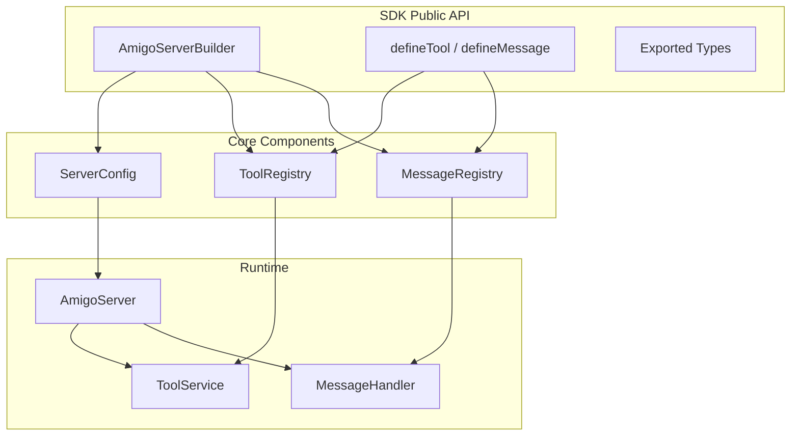

# Design Document

## Overview

本设计文档描述了将 Amigo 服务端封装为可扩展 SDK 的技术方案。SDK 采用 Zod + TypeScript 的双重类型系统，通过 Registry 模式实现动态扩展，并提供 Builder API 简化配置流程。

核心设计原则：
- **类型安全优先**: 使用 Zod Schema 同时提供编译时类型检查和运行时验证
- **零配置启动**: 所有配置项提供合理默认值
- **渐进式扩展**: 从简单配置到复杂自定义的平滑过渡

## Architecture



## Components and Interfaces

### 1. ServerConfig - 服务器配置

```typescript
import { z } from "zod";

// 配置 Schema
export const ServerConfigSchema = z.object({
  port: z.number().int().min(1).max(65535).default(10013),
  storagePath: z.string().default("./storage"),
  // 未来可扩展的配置项
  maxConnections: z.number().int().positive().optional(),
  heartbeatInterval: z.number().int().positive().optional(),
});

export type ServerConfig = z.infer<typeof ServerConfigSchema>;
```

### 2. Tool Definition - 工具定义

现有架构中 `params` 是一个手动定义的数组结构，用于 XML 解析。SDK 需要兼容这个机制，同时提供 Zod Schema 进行运行时验证。

```typescript
import { z, ZodType, ZodObject } from "zod";

/**
 * 工具参数定义（兼容现有 XML 解析机制）
 * 这是现有架构的核心结构，必须保持兼容
 */
export interface ToolParam {
  name: string;
  description: string;
  optional: boolean;
  type?: "string" | "array" | "object"; // 用于 XML 解析器判断如何处理
  params?: ToolParam[]; // 嵌套参数（用于 array 和 object 类型）
}

/**
 * 工具定义接口（完全兼容现有 ToolInterface）
 */
export interface ToolDefinition<TName extends string, TParams, TResult> {
  name: TName;
  description: string;
  whenToUse: string;
  params: ToolParam[]; // 保持现有结构，用于 XML 解析和参数验证
  useExamples: string[];
  invoke: (context: ToolInvokeContext<TParams>) => Promise<{
    message: string;
    toolResult: TResult;
  }>;
}

// 工具调用上下文
export interface ToolInvokeContext<TParams> {
  params: TParams;
  getCurrentTask: () => string;
  getToolFromName: (name: string) => ToolDefinition<any, any, any> | undefined;
  signal?: AbortSignal;
  postMessage?: (msg: string | object) => void;
}
```

### 3. Message Definition - 消息定义

现有消息使用 Zod Schema 定义，格式为 `{ type: z.literal("xxx"), data: z.object({...}) }`。
SDK 需要兼容这个结构，允许用户注册自定义消息类型。

```typescript
import { z, ZodType, ZodObject } from "zod";

/**
 * 消息 Schema 接口（兼容现有 ServerSendMessageSchema 结构）
 * 用户定义的消息必须符合 { type: z.literal("xxx"), data: z.object({...}) } 格式
 */
export type MessageSchema<TType extends string, TData extends ZodObject<any>> = z.ZodObject<{
  type: z.ZodLiteral<TType>;
  data: TData;
}>;

/**
 * 消息定义接口
 */
export interface MessageDefinition<TType extends string, TData extends ZodObject<any>> {
  type: TType;
  schema: MessageSchema<TType, TData>; // 完整的 Zod Schema
  // 可选的消息处理器（用于服务端接收消息时的处理）
  handler?: (data: z.infer<TData>) => void | Promise<void>;
}
```

### 4. Registry - 注册表

```typescript
// 工具注册表
export class ToolRegistry {
  private tools: Map<string, ToolDefinition<any, any, any>> = new Map();
  
  register<TName extends string, TParams extends ZodObject<any>, TResult>(
    tool: ToolDefinition<TName, TParams, TResult>
  ): void {
    if (this.tools.has(tool.name)) {
      throw new Error(`Tool "${tool.name}" is already registered`);
    }
    this.tools.set(tool.name, tool);
  }
  
  get(name: string): ToolDefinition<any, any, any> | undefined {
    return this.tools.get(name);
  }
  
  getAll(): ToolDefinition<any, any, any>[] {
    return Array.from(this.tools.values());
  }
}

// 消息注册表
export class MessageRegistry {
  private messages: Map<string, MessageDefinition<any, any>> = new Map();
  
  register<TType extends string, TData extends ZodObject<any>>(
    message: MessageDefinition<TType, TData>
  ): void {
    if (this.messages.has(message.type)) {
      throw new Error(`Message type "${message.type}" is already registered`);
    }
    this.messages.set(message.type, message);
  }
  
  get(type: string): MessageDefinition<any, any> | undefined {
    return this.messages.get(type);
  }
  
  getAll(): MessageDefinition<any, any>[] {
    return Array.from(this.messages.values());
  }
  
  // 获取所有消息的 Zod Schema 数组（用于合并到现有 discriminatedUnion）
  getAllSchemas(): z.ZodObject<any>[] {
    return this.getAll().map(msg => msg.schema);
  }
}
```

### 5. Builder API - 构建器

```typescript
export class AmigoServerBuilder {
  private config: Partial<ServerConfig> = {};
  private toolRegistry = new ToolRegistry();
  private messageRegistry = new MessageRegistry();
  
  port(port: number): this {
    this.config.port = port;
    return this;
  }
  
  storagePath(path: string): this {
    this.config.storagePath = path;
    return this;
  }
  
  registerTool<TName extends string, TParams extends ZodObject<any>, TResult>(
    tool: ToolDefinition<TName, TParams, TResult>
  ): this {
    this.toolRegistry.register(tool);
    return this;
  }
  
  registerMessage<TType extends string, TData extends ZodType<any>>(
    message: MessageDefinition<TType, TData>
  ): this {
    this.messageRegistry.register(message);
    return this;
  }
  
  build(): AmigoServer {
    const validatedConfig = ServerConfigSchema.parse(this.config);
    return new AmigoServer({
      config: validatedConfig,
      toolRegistry: this.toolRegistry,
      messageRegistry: this.messageRegistry,
    });
  }
}
```

### 6. Helper Functions - 辅助函数

```typescript
import { z, ZodObject, ZodType } from "zod";

/**
 * 定义工具的辅助函数（完全兼容现有架构）
 * 
 * 与现有 createTool 功能相同，但支持泛型类型推断
 */
export function defineTool<
  TName extends string,
  TParams,
  TResult
>(definition: {
  name: TName;
  description: string;
  whenToUse: string;
  params: ToolParam[]; // 保持现有 XML 解析结构
  useExamples: string[];
  invoke: (context: ToolInvokeContext<TParams>) => Promise<{
    message: string;
    toolResult: TResult;
  }>;
}): ToolDefinition<TName, TParams, TResult> {
  return definition;
}

/**
 * 定义消息的辅助函数（兼容现有 Zod Schema 结构）
 * 
 * 生成符合 { type: z.literal("xxx"), data: z.object({...}) } 格式的消息定义
 */
export function defineMessage<
  TType extends string,
  TData extends ZodObject<any>
>(definition: {
  type: TType;
  dataSchema: TData;
  handler?: (data: z.infer<TData>) => void | Promise<void>;
}): MessageDefinition<TType, TData> {
  return {
    type: definition.type,
    schema: z.object({
      type: z.literal(definition.type),
      data: definition.dataSchema,
    }) as MessageSchema<TType, TData>,
    handler: definition.handler,
  };
}
```

## Data Models

### Tool Schema 示例

```typescript
// 用户定义的自定义工具示例（兼容现有架构）
const myCustomTool = defineTool({
  name: "my_custom_tool",
  description: "A custom tool that does something useful",
  whenToUse: "When user needs to perform a specific action",
  
  // params: 保持现有结构，用于 XML 解析
  params: [
    {
      name: "query",
      optional: false,
      description: "The search query",
      // type 默认为 string，可省略
    },
    {
      name: "limit",
      optional: true,
      description: "Max results to return",
    },
    {
      name: "filters",
      optional: true,
      description: "Search filters",
      type: "array",
      params: [
        {
          name: "filter",
          optional: false,
          description: "A single filter value",
        }
      ]
    }
  ],
  
  
  useExamples: [
    `<my_custom_tool>
      <query>example query</query>
      <limit>10</limit>
      <filters>
        <filter>category:tech</filter>
        <filter>date:2024</filter>
      </filters>
    </my_custom_tool>`,
  ],
  
  invoke: async ({ params }) => {
    // params 类型自动推断为 { query: string; limit?: number; filters?: string[] }
    return {
      message: "Tool executed successfully",
      toolResult: { results: [], query: params.query },
    };
  },
});
```

### Message Schema 示例

```typescript
// 用户定义的自定义消息示例
const myCustomMessage = defineMessage({
  type: "customNotification",
  dataSchema: z.object({
    title: z.string(),
    content: z.string(),
    priority: z.enum(["low", "medium", "high"]),
  }),
  handler: async (data) => {
    console.log(`Notification: ${data.title}`);
  },
});
```


## Correctness Properties

*A property is a characteristic or behavior that should hold true across all valid executions of a system-essentially, a formal statement about what the system should do. Properties serve as the bridge between human-readable specifications and machine-verifiable correctness guarantees.*

### Property 1: Server config application
*For any* valid port number (1-65535) and valid storage path, when the SDK user creates a server with these configurations, the server SHALL use exactly those values for its port and storage path.
**Validates: Requirements 1.1, 1.2**

### Property 2: Invalid config rejection
*For any* invalid configuration value (port outside 1-65535, or invalid path characters), when the SDK user attempts to create a server, the SDK SHALL throw a ZodError with a descriptive message.
**Validates: Requirements 1.4**

### Property 3: Tool parameter validation
*For any* tool definition with params array and any input parameters, the SDK SHALL validate parameters using the existing parseAndExecute mechanism and reject invalid parameters with a clear error message.
**Validates: Requirements 2.2, 2.3**

### Property 4: Tool definition completeness
*For any* tool definition missing any required field (name, description, whenToUse, paramsSchema, invoke), the SDK SHALL reject the definition at registration time.
**Validates: Requirements 2.4**

### Property 5: Duplicate tool rejection
*For any* two tools with the same name, when registering the second tool, the SDK SHALL throw an error indicating the name conflict.
**Validates: Requirements 2.5**

### Property 6: Message validation
*For any* message definition with a Zod data schema and any incoming message data, the SDK SHALL validate the data against the schema and reject invalid data with a clear error.
**Validates: Requirements 3.2, 3.3**

### Property 7: Message definition completeness
*For any* message definition missing type name or data schema, the SDK SHALL reject the definition at registration time.
**Validates: Requirements 3.5**

### Property 8: Duplicate message rejection
*For any* two message definitions with the same type name, when registering the second message, the SDK SHALL throw an error indicating the type conflict.
**Validates: Requirements 3.4**

### Property 9: Builder chaining
*For any* sequence of builder method calls (port, storagePath, registerTool, registerMessage), each method SHALL return the same builder instance, enabling method chaining.
**Validates: Requirements 4.1**

### Property 10: Builder produces server
*For any* valid builder configuration, calling build() SHALL return an AmigoServer instance with the accumulated configuration.
**Validates: Requirements 4.2**

### Property 11: Registry accumulation
*For any* N tools and M messages registered via builder, the final server SHALL contain exactly N tools and M messages in its registries.
**Validates: Requirements 4.3, 4.4**

### Property 12: Tool definition round-trip
*For any* valid tool definition, serializing to JSON and parsing back SHALL produce an equivalent tool definition (excluding the invoke function which cannot be serialized).
**Validates: Requirements 5.4, 5.5**

### Property 13: Registry retrieval correctness
*For any* tool or message registered in a registry, retrieving by name/type SHALL return the exact same definition that was registered.
**Validates: Requirements 6.4**

## Error Handling

### Configuration Errors

| Error Type | Condition | Message Format |
|------------|-----------|----------------|
| `ZodError` | Invalid port number | "Port must be between 1 and 65535" |
| `ZodError` | Invalid storage path | "Storage path must be a valid string" |
| `RegistrationError` | Duplicate tool name | "Tool '{name}' is already registered" |
| `RegistrationError` | Duplicate message type | "Message type '{type}' is already registered" |
| `ValidationError` | Invalid tool params | "Tool '{name}' parameter validation failed: {details}" |
| `ValidationError` | Invalid message data | "Message '{type}' data validation failed: {details}" |

### Error Handling Strategy

```typescript
// 自定义错误类型
export class RegistrationError extends Error {
  constructor(message: string) {
    super(message);
    this.name = "RegistrationError";
  }
}

export class ValidationError extends Error {
  constructor(
    message: string,
    public readonly details: z.ZodError
  ) {
    super(message);
    this.name = "ValidationError";
  }
}
```

## Testing Strategy

### Dual Testing Approach

本项目采用单元测试和属性测试相结合的方式：

- **单元测试**: 验证具体示例、边界情况和错误条件
- **属性测试**: 验证应在所有输入上成立的通用属性

### Property-Based Testing Framework

使用 **fast-check** 作为属性测试库，配置每个属性测试运行至少 100 次迭代。

### Test File Structure

```
packages/server/src/sdk/
├── __tests__/
│   ├── config.test.ts          # 配置相关测试
│   ├── config.property.test.ts # 配置属性测试
│   ├── tool-registry.test.ts   # 工具注册测试
│   ├── tool-registry.property.test.ts
│   ├── message-registry.test.ts
│   ├── message-registry.property.test.ts
│   ├── builder.test.ts
│   ├── builder.property.test.ts
│   └── serialization.property.test.ts
```

### Property Test Annotation Format

每个属性测试必须使用以下格式标注：

```typescript
/**
 * **Feature: server-sdk, Property 3: Tool parameter validation**
 * **Validates: Requirements 2.2, 2.3**
 */
test.prop([toolDefinitionArb, paramsArb], { numRuns: 100 })(
  "tool params validation",
  (toolDef, params) => {
    // test implementation
  }
);
```

### Test Generators (Arbitraries)

```typescript
import * as fc from "fast-check";

// 有效端口号生成器
const validPortArb = fc.integer({ min: 1, max: 65535 });

// 无效端口号生成器
const invalidPortArb = fc.oneof(
  fc.integer({ max: 0 }),
  fc.integer({ min: 65536 })
);

// 有效存储路径生成器
const validStoragePathArb = fc.stringMatching(/^[a-zA-Z0-9_\-./]+$/);

// 工具名称生成器
const toolNameArb = fc.stringMatching(/^[a-z][a-z0-9_]*$/);

// 消息类型生成器
const messageTypeArb = fc.stringMatching(/^[a-zA-Z][a-zA-Z0-9]*$/);

// Zod Schema 生成器（简化版）
const simpleZodSchemaArb = fc.constantFrom(
  z.object({ query: z.string() }),
  z.object({ id: z.number() }),
  z.object({ enabled: z.boolean() }),
  z.object({ items: z.array(z.string()) })
);
```

## SDK Public API Summary

```typescript
// 主入口
export { AmigoServerBuilder } from "./builder";
export { defineTool, defineMessage } from "./helpers";

// 类型导出
export type { 
  ServerConfig,
  ToolDefinition,
  ToolParamMeta,
  ToolInvokeContext,
  MessageDefinition,
} from "./types";

// 注册表（高级用法）
export { ToolRegistry, MessageRegistry } from "./registry";

// 错误类型
export { RegistrationError, ValidationError } from "./errors";

// 使用示例
import { AmigoServerBuilder, defineTool, defineMessage } from "@amigo/server";
import { z } from "zod";

const server = new AmigoServerBuilder()
  .port(8080)
  .storagePath("./my-storage")
  .registerTool(defineTool({
    name: "my_tool",
    description: "My custom tool",
    whenToUse: "When needed",
    // params: 用于 XML 解析（与现有 ToolInterface 完全兼容）
    params: [
      { name: "input", optional: false, description: "Input text" }
    ],
    useExamples: ["<my_tool><input>test</input></my_tool>"],
    invoke: async ({ params }) => ({
      message: "Done",
      toolResult: params.input.toUpperCase(),
    }),
  }))
  .registerMessage(defineMessage({
    type: "myNotification",
    dataSchema: z.object({ text: z.string() }),
  }))
  .build();

server.start();
```
