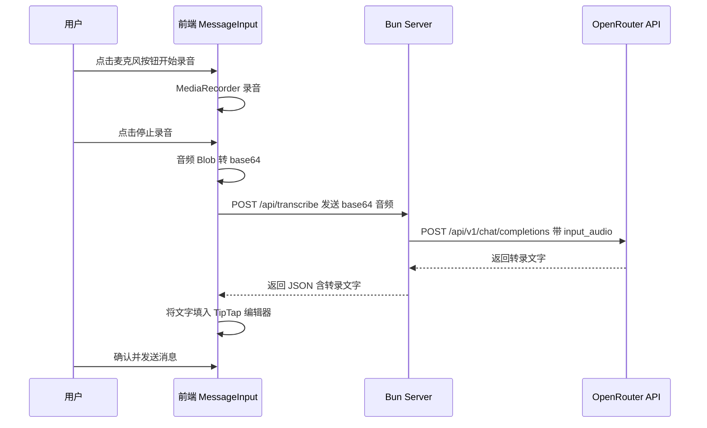

# 语音转文字输入功能实现计划

## 概述

为 Amigo 项目添加语音转文字功能。用户在前端点击麦克风按钮开始/停止录音，录音完成后将音频数据发送到服务端，服务端调用 OpenRouter 支持音频的模型进行转录，转录结果返回前端并填入输入框供用户确认后发送。

## 架构设计



## 技术选型

| 组件 | 技术方案 |
|------|---------|
| 前端录音 | Web MediaRecorder API |
| 音频格式 | WebM/Opus 录制，发送时使用 wav 或直接发送 webm |
| 前端→服务端传输 | HTTP POST /api/transcribe，JSON body 含 base64 音频 |
| 服务端转录 | 直接调用 OpenRouter /api/v1/chat/completions，使用 input_audio 内容类型 |
| 音频模型 | google/gemini-2.0-flash-lite-001 或可配置的 STT_MODEL_NAME 环境变量 |
| UI 组件 | lucide-react 的 Mic / MicOff 图标 |

## 需要修改的文件

### 1. 服务端

#### 1.1 `packages/server/src/core/server/index.ts`
- 在 `fetch` 处理器中增加 HTTP 路由逻辑
- 非 WebSocket 升级请求时，检查路径是否为 `/api/transcribe`
- 处理 CORS 头（前端可能跨域访问）

#### 1.2 新建 `packages/server/src/core/transcribe/index.ts`
- 创建 `transcribeAudio` 函数
- 接收 base64 音频数据和格式
- 调用 OpenRouter API 的 `/api/v1/chat/completions` 端点
- 使用 `input_audio` 内容类型发送音频
- 提取并返回转录文字

#### 1.3 `packages/server/.env`
- 添加 `STT_MODEL_NAME` 环境变量（默认值：`google/gemini-2.0-flash-lite-001`）

### 2. 前端

#### 2.1 新建 `packages/frontend/src/components/MessageInput/hooks/useVoiceRecorder.ts`
- 封装 MediaRecorder 录音逻辑
- 管理录音状态：idle / recording / transcribing
- 提供 startRecording / stopRecording 方法
- 停止录音后自动将音频转为 base64 并发送到服务端
- 返回转录结果

#### 2.2 修改 `packages/frontend/src/components/MessageInput/index.tsx`
- 引入 useVoiceRecorder hook
- 在发送按钮左侧添加麦克风按钮
- 录音中显示红色脉冲动画和录音时长
- 转录中显示 loading 状态
- 转录完成后将文字插入 TipTap 编辑器

#### 2.3 修改 `packages/frontend/src/components/MessageInput/styles.ts`
- 添加麦克风按钮样式
- 添加录音中的脉冲动画样式
- 添加录音时长显示样式

## 详细实现步骤

### Step 1: 服务端 - 创建转录服务

新建 `packages/server/src/core/transcribe/index.ts`：

```typescript
// 调用 OpenRouter API 进行音频转录
export async function transcribeAudio(
  base64Audio: string, 
  format: string
): Promise<string> {
  const apiKey = process.env.MODEL_API_KEY;
  const baseUrl = process.env.MODEL_BASE_URL || "https://openrouter.ai/api/v1";
  const model = process.env.STT_MODEL_NAME || "google/gemini-2.0-flash-lite-001";

  const response = await fetch(`${baseUrl}/chat/completions`, {
    method: "POST",
    headers: {
      "Authorization": `Bearer ${apiKey}`,
      "Content-Type": "application/json",
    },
    body: JSON.stringify({
      model,
      messages: [{
        role: "user",
        content: [
          { type: "text", text: "请将这段音频转录为文字，只输出转录的文字内容，不要添加任何额外说明。" },
          { type: "input_audio", input_audio: { data: base64Audio, format } }
        ]
      }]
    })
  });

  const result = await response.json();
  return result.choices[0].message.content;
}
```

### Step 2: 服务端 - 扩展 HTTP 路由

修改 `packages/server/src/core/server/index.ts` 的 `fetch` 处理器：

```typescript
fetch: async (req: any, server: any) => {
  const url = new URL(req.url);
  
  // CORS 预检
  if (req.method === "OPTIONS") {
    return new Response(null, {
      headers: {
        "Access-Control-Allow-Origin": "*",
        "Access-Control-Allow-Methods": "POST, OPTIONS",
        "Access-Control-Allow-Headers": "Content-Type",
      }
    });
  }
  
  // 语音转录 API
  if (url.pathname === "/api/transcribe" && req.method === "POST") {
    const body = await req.json();
    const { audio, format } = body;
    const text = await transcribeAudio(audio, format);
    return new Response(JSON.stringify({ text }), {
      headers: {
        "Content-Type": "application/json",
        "Access-Control-Allow-Origin": "*",
      }
    });
  }
  
  // WebSocket 升级
  if (server.upgrade(req)) {
    return;
  }
  return new Response("Not found", { status: 404 });
}
```

### Step 3: 前端 - 创建录音 Hook

新建 `packages/frontend/src/components/MessageInput/hooks/useVoiceRecorder.ts`：

核心逻辑：
- 使用 `navigator.mediaDevices.getUserMedia` 获取麦克风权限
- 使用 `MediaRecorder` 录音，收集音频 chunks
- 停止录音后将 Blob 转为 base64
- 通过 `fetch` 发送到 `http://localhost:10013/api/transcribe`
- 返回状态和控制方法

### Step 4: 前端 - 修改 MessageInput 组件

在输入框内部右下角，发送按钮左侧添加麦克风按钮：
- **idle 状态**：显示 Mic 图标，灰色
- **recording 状态**：显示 MicOff 图标 + 红色脉冲动画 + 录音时长
- **transcribing 状态**：显示 loading spinner

### Step 5: 前端 - 更新样式

添加录音相关的 CSS 样式，包括脉冲动画和按钮布局调整。

## UI 布局示意

```
┌─────────────────────────────────────────────────────┐
│                                                     │
│  输入消息或选择技能...                                │
│                                                     │
│                                    [🎤]  [➤]       │
└─────────────────────────────────────────────────────┘

录音中状态：
┌─────────────────────────────────────────────────────┐
│                                                     │
│  🔴 正在录音... 00:05                                │
│                                                     │
│                                    [⏹]   [➤]       │
└─────────────────────────────────────────────────────┘
```

## 环境变量

在 `.env` 中新增：
```
# 语音转文字模型 (默认: google/gemini-2.0-flash-lite-001)
STT_MODEL_NAME=google/gemini-2.0-flash-lite-001
```

## 注意事项

1. **浏览器兼容性**：MediaRecorder API 在现代浏览器中广泛支持，但需要 HTTPS 或 localhost 环境
2. **音频格式**：浏览器 MediaRecorder 默认录制 webm/opus 格式，OpenRouter 支持此格式（opus）
3. **错误处理**：需要处理麦克风权限拒绝、网络错误、转录失败等情况
4. **文件大小**：应限制录音时长（建议最长 60 秒），避免音频文件过大
5. **CORS**：服务端需要添加 CORS 头，因为前端 Vite 开发服务器和 Bun 服务器端口不同
